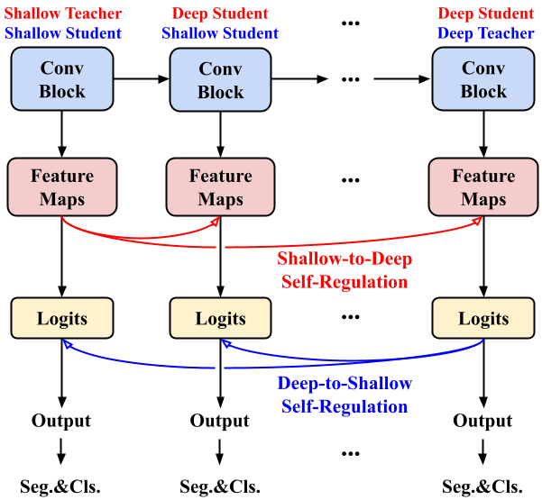

# Self-Regulation for Semantic Segmentation

This is the PyTorch implementation of paper [Self-Regulation for Semantic Segmentation](https://github.com/dongzhang89/SR-SS), ICCV 2021.





## Installation Instructions
- Clone this repo:

```bash
git clone git@github.com:dongzhang89/SR-SS.git
cd SR-SS
```
