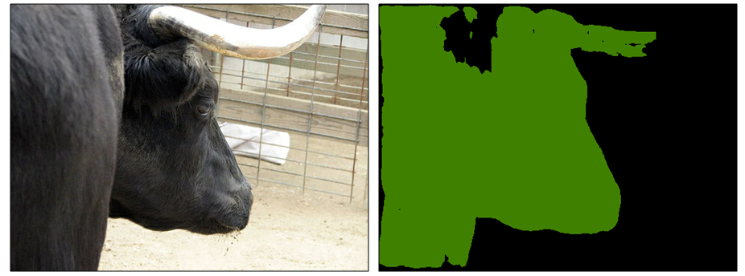

# Self-Regulation for Semantic Segmentation

This is the PyTorch implementation for paper [Self-Regulation for Semantic Segmentation](https://arxiv.org/abs/2108.09702), ICCV 2021.


## Contact
* This project is a demo implementation for SR. 
* If you have any questions, don't hesitate to contact: dongzhang@njust.edu.cn

## Installation Instructions
- Clone this repo:
```bash
git clone git@github.com:dongzhang89/SR-SS.git
cd SR-SS
```

- Install PyTorch 0.4.0:
```bash
pip install pytorch==0.4.0
```
GPU is not necessary, but it will be very slow without GPU.

- Install Python Package
```bash
pip install -r requirements
```
Tensorflow is necessary for tensorboardX. If you don't want to use tensorboardX for visualization, delete it.

- Dataset preparation
We use the PASCAL VOC 2012 dataset in SR. Go to the [official webpage](http://host.robots.ox.ac.uk/pascal/VOC/voc2012/) and download the training images. We use the augmented pseudo-labels in experiments. The final file structure is shown below：
```
data
  |- VOC2012
    |- SegmentationClassAug_pseudo_label #label path
    |- JPEGImages #image path
```

## Usage
### Demo
Test on a single image could be done by running:
```
python demo.py --img_path path --model path/weight
```
You can get a similar image as:



* Result image could be saved as **result.jpg**.
* To be noticed, the trained model can be loaded by:
```
checkpoint = torch.load(model_path)
net.load_state_dict(checkpoint['model'])
```

### Train
Training your own model could be done by running:
```
python trainval.py
```
* Change the command line arguments if necessary. 
* To speed up the training process, we use the loss for the presences of object categories instead of classification, but the performance of these two methods is quite similar.
* Please first train the model by 10000 iterations using only MEA loss and switch on the SR loss for the remaining iterations.

### Test
Testing your trained model could be done by running:
```
python test.py --model=path/model
```
* Then you can see the final result on PASCAL VOC2012 after a while. 
* We believe designing more complicated training weight for loss items also benefits for the model performance.

### TensorboardX
Monitor your training process with tensorboardX. Run:
```
tensorboard --logdir=$DEEPLAB_V2_PYTORCH/logs/loss_lr/lr --port=7001
```
Then open your firefox or chrome, and visit localhost:7001. 
 
## Acknowledgement
This project heavily relies on the following projects:
- [isht7/pytorch-deeplab-resnet](https://github.com/isht7/pytorch-deeplab-resnet)
- [kazuto1011/deeplab-pytorch](https://github.com/kazuto1011/deeplab-pytorch)
- [DrSleep/tensorflow-deeplab-resnet](https://github.com/DrSleep/tensorflow-deeplab-resnet)
- [jwyang/faster-rcnn.pytorch](https://github.com/jwyang/faster-rcnn.pytorch)
- [zhanghang1989/PyTorch-Encoding](https://github.com/zhanghang1989/PyTorch-Encoding)

## Citing SR-SS
You may want to cite:
```
@article{zhang2021sr,
  title={Self-Regulation for Semantic Segmentation},
  author={Dong, Zhang and Hanwang, Zhang and Jinhui, Tang and Xiansheng, Hua and Qianru, Sun},
  journal={International Conference on Computer Vision (ICCV)},
  year={2021}
}
```